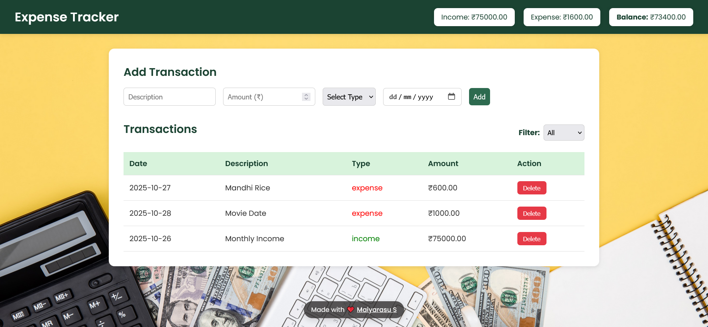

# Expense-Tracker
A simple and responsive Expense Tracker web app to record, categorize, and manage your daily income and expenses with balance insights.
Check out my landing page:  

CLICK THIS LINK 🔗 ➤➤➤➤ 
---

## 🚀 Features

- 📥 **Add Transactions** – Quickly record income or expenses with description, amount, and date.  
- 📊 **Auto-Updated Summary** – Instantly see your total income, expenses, and remaining balance.  
- 🔍 **Filter by Type** – View only income or expense transactions as needed.  
- 💾 **Local Storage Support**  – Keeps your data even after refreshing the page.  
- 🎨 **Clean, Modern UI** – Simple design with subtle shadows and responsive layout.  
- ❤️ **Personal Touch** – Floating tag at the bottom: “Made with ❤️ [Maiyarasu S](https://github.com/MaiyarasuS)”.

---

## 🧠 Tech Stack

- **HTML5** – Structure  
- **CSS3** – Styling and layout  
- **JavaScript (Vanilla)** – Logic and interactivity  

